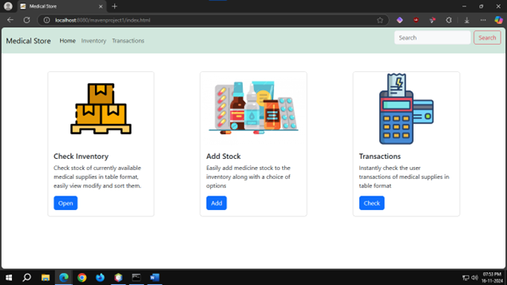
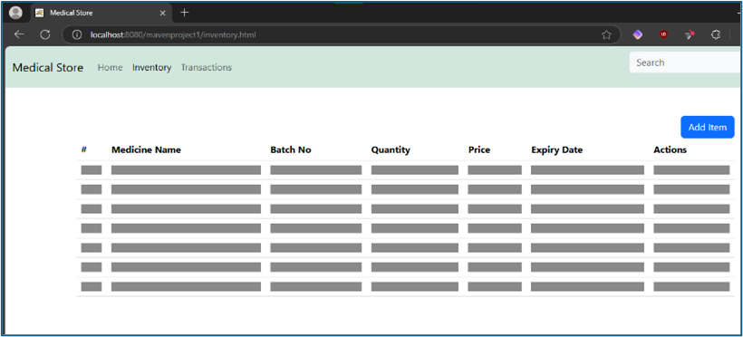
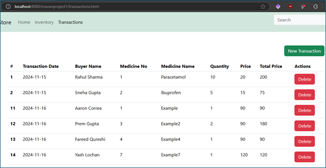
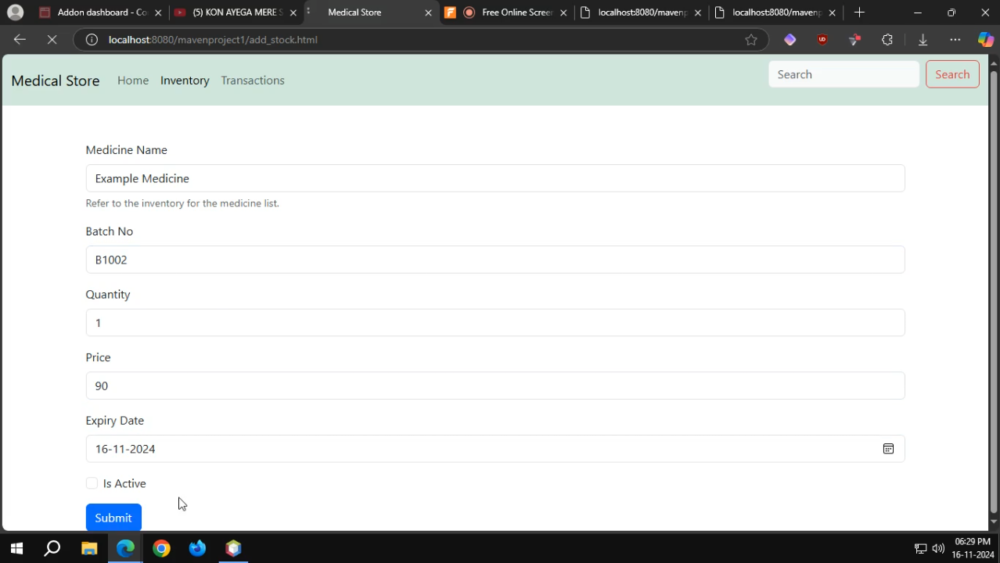
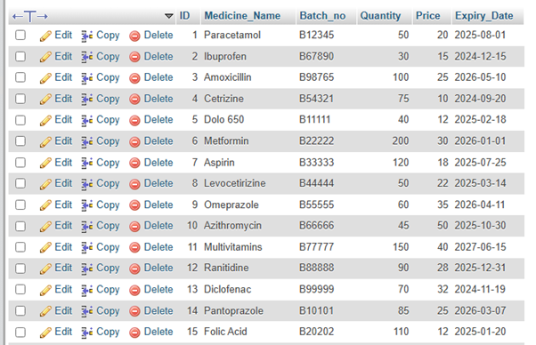
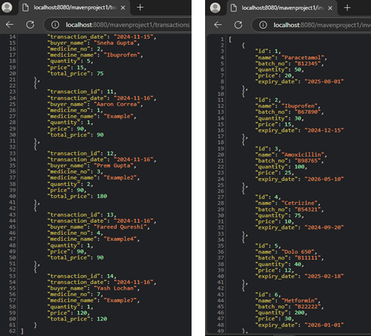

# 💊 Medical Store Web Application

A simple and responsive medical store inventory management system built using **HTML**, **Bootstrap 5**, **vanilla JavaScript**, and a **Java Servlets** backend for handling server-side operations.

## 🧾 Features

- 🏠 Home page with navigation bar
- 📦 Inventory page for listing medicines
- 💸 Transactions page to record and display medicine sales
- ➕ Add new transactions easily
- 🔍 Search bar in navbar for easy navigation
- 🚀 Bootstrap placeholders used for smooth loading UI

## 📂 Pages

- `index.html` – Home
- `inventory.html` – View medicine inventory
- `transactions.html` – View transactions table with placeholder animations
- `add_trans.html` – Add a new transaction (button linked)

## 🖼️ UI Highlights

- Clean and modern **Bootstrap 5** interface
- Responsive navbar with collapsible mobile menu
- Floating "New Transaction" button
- Placeholder table rows (loading shimmer effect)
- Light and accessible color scheme

## 🛠️ Tech Stack

- Frontend: `HTML5`, `CSS3` (via Bootstrap), `JavaScript`
- Backend: **Java Servlets** (for server-side functionality)
- UI Framework: [Bootstrap 5.3](https://getbootstrap.com/)

## 📷 Screenshots

  
Click to view images

